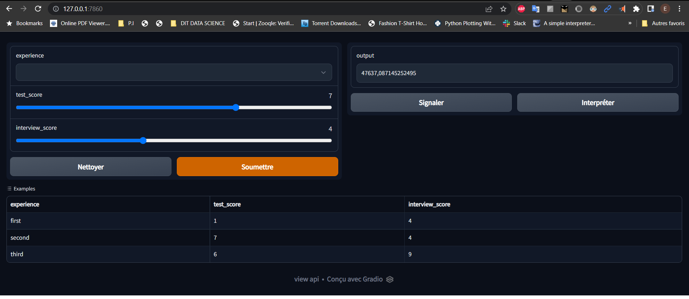
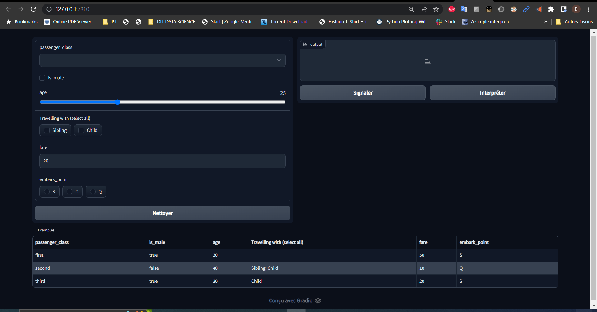

# 🚀 Friendly Web Interface for ML Projects with Gradio & Streamlit 🚀

There are many ways to make web interfaces to allow interaction with Machine Learning models and we will cover two of them.

<!-- You can find the slides of my talk at <https://meissa-wimlds-presentation.netlify.app>. -->

## Description

<!-- 
[gradio](https://gradio.app/)
[streamlit](https://streamlit.io/)
-->

You will have a minimal interface demo with [Gradio](https://gradio.app/) & [Streamlit](https://streamlit.io/), this will just serve you to make sure that everything works correctly. Then, you will have to make your own interfaces, those allowing you to interact with a Machine Learning model, that is to say:
- Pass values through the interface;
- Recover these values in backend;
- Apply the necessary processing;
- Submit the previously processed values to the ML model to make the predictions;
- Process the predictions obtained and display them on the interface.

## Installation

You have two ways in order to setup and run this project.

### Manual Setup

For manual installation, you need to have [`Python3`](https://www.python.org/) on your system. Then you can clone this repo and being at the repo's `root :: friendly_web_interface_for_ML_models> ...`  follow the steps below:

- Create a virtual environment with the command :
        
        python3 -m venv venv

- Activate the virtual environment with the command :
  
  Windows:

      venv/bin/activate 
  
  Linux: 

      source venv/bin/activate

- Install the necessary dependencies with the command :
        
      python -m pip install --upgrade pip; python -m pip install -r requirements.txt

- Run the demo apps :
        
  - Gradio:
    
    - Demo

          python gradio_project/basic_demo/app.py

    - Salary prediction

          python gradio_project/salary/app.py

    - Titanic survival prediction

          python gradio_project/titanic/app.py   

  - Go to your browser at the following address :
        
      http://127.0.0.1:7860/

  Streamlit: 

      streamlit run streamlit_project/basic_demo/app.py

  - Go to your browser at the following address :
        
      http://localhost:8501

<!-- ## Structure
### File: app.py

### Folder: ml 

C:.
├───.pytest_cache
│   └───v
│       └───cache
├───gradio_project
│   ├───salary 
│   └───titanic
├───ml
│   ├───salary
│   └───titanic
├───streamlit_project
└───tests
    ├───gradio_project
    ├───ml
    └───streamlit_project

-->

## Screenshots

<table>
    <tr>
        <th>Gradio Salary Prediction</th>
        <th>Gradio Titanic Survival Prediction</th>
    </tr>
    <tr>
        <td></td>
        <td></td>
    </tr>
</table>

<table>
    <tr>
        <th>Streamlit Basic Demo</th>
    </tr>
    <tr>
        <td></td>
    </tr>
</table>

## Resources
Here are some ressources you would read to have a good understanding of Gradio and Streamlit :
- [Get started with Streamlit](https://docs.streamlit.io/library/get-started/create-an-app)

- [Get started with Gradio](https://gradio.app/getting_started/)

## Contributing

Feel free to make a PR or report an issue 😃.

Oh, one more thing, please do not forget to put a description when you make your PR 🙂.

## Author

- [Emmanuel KOUPOH](https://www.linkedin.com/in/esa%C3%AFe-alain-emmanuel-dina-koupoh-7b974a17a/)
