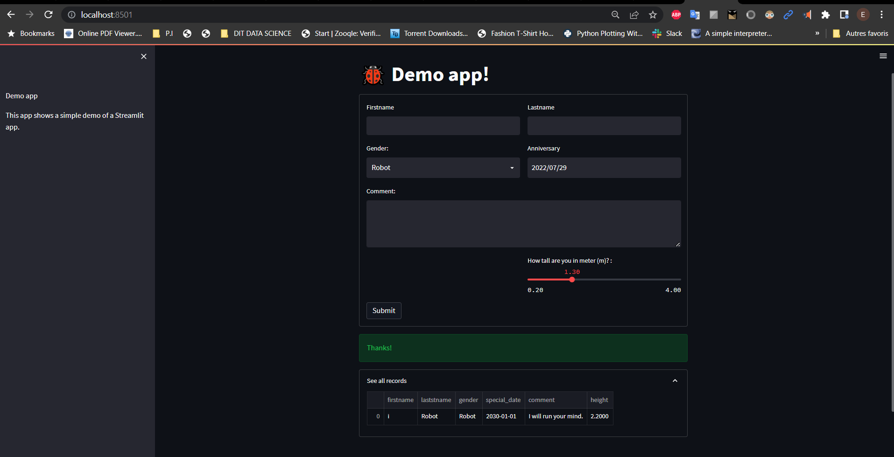

# 🚀 Friendly Web Interface for ML Projects with Streamlit 🚀

There are many ways to make web interfaces to allow interaction with Machine Learning models and we will cover two of them.

## Introduction

Now that you know how to build some Machine Learning models, it is the time to discover how to embeded it into a web app with a user-friendly interface. You have already seen, of course, some ML tools and you maybe played with it. If so, you know that it is much more interesting to interact with a ML model through a beautiful interface than using a notebook, especially when you are not an expert of this domain.  

In this project, we aim to help you to discover how to embed a ML model into a web app to interact with it much easier, by inputing the required information, making predictions and showing the result.

<!-- You can find the slides of my talk at <https://meissa-wimlds-presentation.netlify.app>. -->

## Description

<!-- 
[streamlit](https://streamlit.io/)
-->

You will have a minimal interface demo with [Streamlit](https://streamlit.io/), this will just serve you to make sure that everything works correctly. Then, you will have to make your own interfaces, those allowing you to interact with a Machine Learning model, that is to say:
- Pass values through the interface;
- Recover these values in backend;
- Apply the necessary processing;
- Submit the previously processed values to the ML model to make the predictions;
- Process the predictions obtained and display them on the interface.

## Instructions

Your task is to understand the frameworks and build your app integrating a ML model.
Your work should follow these next steps.

1.  Build a Streamlit app to embed the classification model you built a few weeks ago.
2.  Create a dashboard to display visualization of data available in your database.
3.  Write an anrticle on the project and publish it on Medium

## Rubrics

Streamlit:

-   **Excellent:** Have an that works correctly with a nice and personalized interface.

-   **Good:** Have an app that launches, makes prediction and shows result.

-   **Fair:** Have an app that launches but having bugs regarding prediction or interface.

## Installation

You have two ways in order to setup and run this project.

- Windows:
        
        python -m venv venv; venv\Scripts\activate; python -m pip install -q --upgrade pip; python -m pip install -qr requirements.txt  

- Linux & MacOs:
        
        python3 -m venv venv; source venv/bin/activate; python -m pip install -q --upgrade pip; python -m pip install -qr requirements.txt  

Both long command-lines have a same structure, they pipe multiple commands using the symbol **;** but you may manually execute them one after another.

1. **Create the Python's virtual environment** that isolates the required libraries of the project to avoid conflicts;
2. **Activate the Python's virtual environment** so that the Python kernel & libraries will be those of the isolated environment;
3. **Upgrade Pip, the installed libraries/packages manager** to have the up-to-date version that will work correctly;
4. **Install the required libraries/packages** listed in the `requirements.txt` file so that it will be allow to import them into the python's scripts and notebooks without any issue.

**NB:** For MacOs users, please install `Xcode` if you have an issue.

- Run the demo apps (being at the repository root):

  Streamlit: 

      streamlit run streamlit_project/basic_demo/app.py

  - Go to your browser at the following address :
        
      http://localhost:8501

<!-- ## Structure
### File: app.py

### Folder: ml 

C:.
├───.pytest_cache
│   └───v
│       └───cache
├───ml
│   ├───salary
│   └───titanic
├───streamlit_project
└───tests
    ├───gradio_project
    ├───ml
    └───streamlit_project

-->

## Screenshots

<table>
    <tr>
        <th>Streamlit Basic Demo</th>
    </tr>
    <tr>
        <td></td>
    </tr>
</table>

## Resources
Here are some ressources you would read to have a good understanding of Streamlit :
- [Get started with Streamlit](https://docs.streamlit.io/library/get-started/create-an-app)

## Contributing

Feel free to make a PR or report an issue 😃.

Oh, one more thing, please do not forget to put a description when you make your PR 🙂.

## Author

- [Emmanuel KOUPOH](https://www.linkedin.com/in/esa%C3%AFe-alain-emmanuel-dina-koupoh-7b974a17a/)
- 
